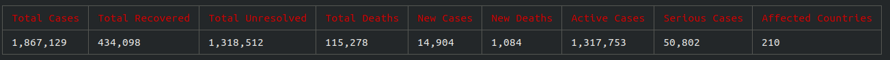
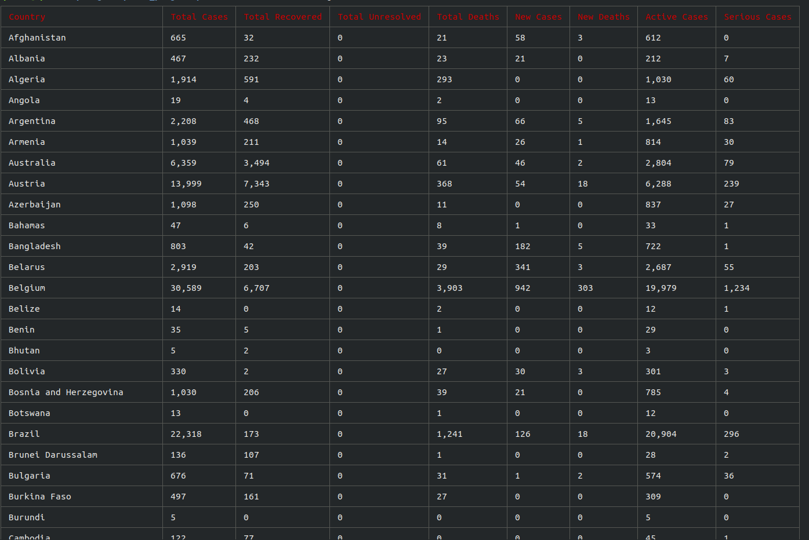
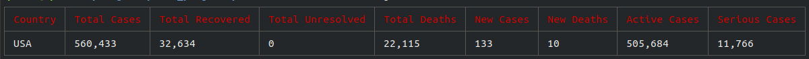
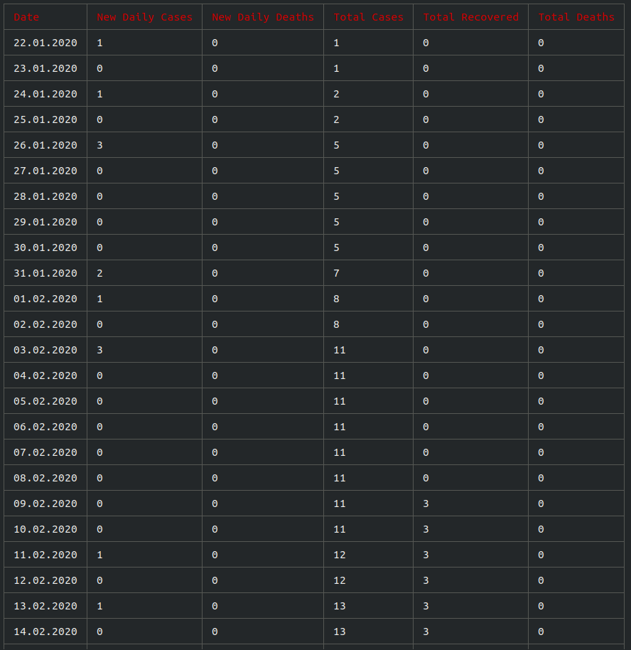

# Terminal COVID-19 Tracker

Terminal based COVID-19 tracker. It built with NodeJS

## Resources and NPM Packages

This project uses [The Virus Tracker API](https://api.thevirustracker.com) to fetch results. And also this project uses [yargs](https://www.npmjs.com/package/yargs) to parse CLI inputs.

# Usage

These are the commands you can use;

**General Help**

```help
cli-covid19 will get global stats by default

Commands:
  index.js        cli-covid19 will get global stats by default         [default]
  index.js codes  Show all country codes
  index.js list   List all countries or by country code

Options:
  --help     Show help                                                 [boolean]
  --version  Show version number                                       [boolean]

```

**List Help**

```help
List all countries or by country code

Options:
  --help     Show help                                                 [boolean]
  --version  Show version number                                       [boolean]
  --all      list all countries                                         [string]
  -c         get country stats
  -t         get country timeline

```

**Codes Help**

```help
Show all country codes

Options:
  --help     Show help                                                 [boolean]
  --version  Show version number                                       [boolean]

```

# Example Usage

## List Global Stats

```bash
node index.js
```



## List All Countries

```bash
node index.js list --all
```




## Get Country Stats

```bash
node index.js list -c us
```



## Get Country Timeline

```bash
node index.js list -t us
```



# Contributions

This project took 10 minutes. So codes may not easily understandable. You might want to refactor them. Pull requests are welcome.